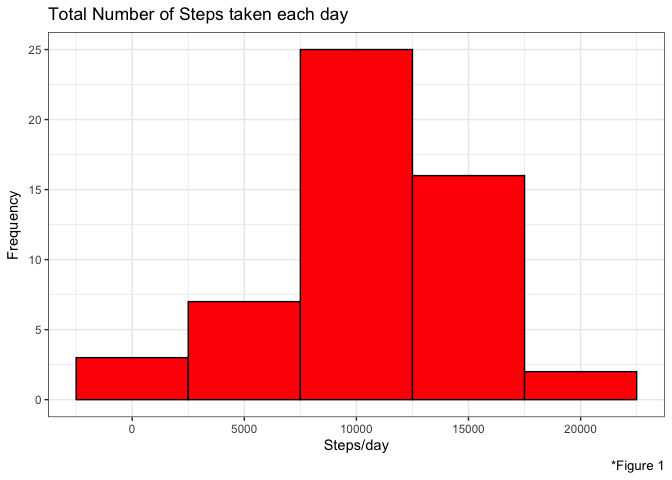
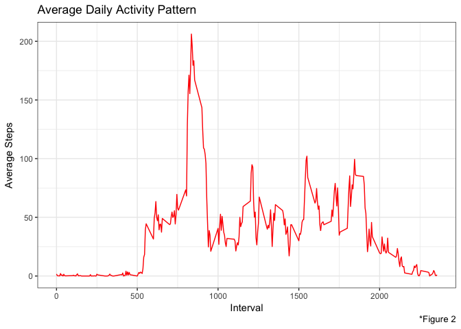
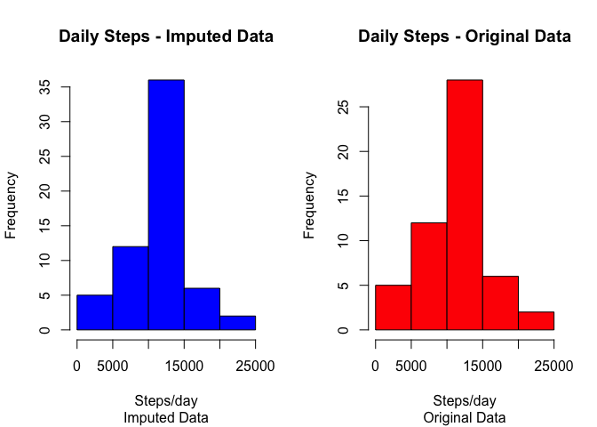
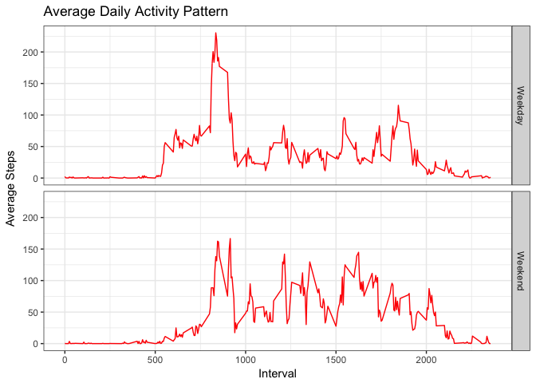

# Reproducible Research: Peer Assessment 1
## Overview
##### Personal Activity Monitoring Data Analysis
It is now possible to collect a large amount of data about personal movement using activity monitoring devices such as a Fitbit, Nike Fuelband, or Jawbone Up. These type of devices are part of the “quantified self” movement – a group of enthusiasts who take measurements about themselves regularly to improve their health, to find patterns in their behavior, or because they are tech geeks. But these data remain under-utilized both because the raw data are hard to obtain and there is a lack of statistical methods and software for processing and interpreting the data.

This assignment makes use of data from a personal activity monitoring device. This device collects data at 5 minute intervals through out the day. The data consists of two months of data from an anonymous individual collected during the months of October and November, 2012 and include the number of steps taken in 5 minute intervals each day.

## 1. Loading and preprocessing the data
*1. Load the data (i.e. 𝚛𝚎𝚊𝚍.𝚌𝚜𝚟())*

##### Setup Environment 


```r
library(dplyr)          # for Data manipulation
library(ggplot2)        # for Graphics
library(lubridate)      # for Date manipulation
```


##### Load the Data
The file 'activity.zip' at the following URL 'https://d396qusza40orc.cloudfront.net/repdata%2Fdata%2Factivity.zip' is manually downloaded and un-zipped.  
It yields a CSV file 'activity.csv' that is the dataset to be used

A quick glance of the file indicates a comma-separated file with 3 columns and presence of header on first line.  
Let's load the dataset and do priliminary analysis.


```r
df <- read.csv("activity.csv", header=TRUE, stringsAsFactors = FALSE)
```
  
  
*2. Process/transform the data (if necessary) into a format suitable for your analysis*

##### Basic Data exploration

```r
dim(df)
```

```
## [1] 17568     3
```

```r
str(df)
```

```
## 'data.frame':	17568 obs. of  3 variables:
##  $ steps   : int  NA NA NA NA NA NA NA NA NA NA ...
##  $ date    : chr  "2012-10-01" "2012-10-01" "2012-10-01" "2012-10-01" ...
##  $ interval: int  0 5 10 15 20 25 30 35 40 45 ...
```

```r
summary(df)
```

```
##      steps            date              interval     
##  Min.   :  0.00   Length:17568       Min.   :   0.0  
##  1st Qu.:  0.00   Class :character   1st Qu.: 588.8  
##  Median :  0.00   Mode  :character   Median :1177.5  
##  Mean   : 37.38                      Mean   :1177.5  
##  3rd Qu.: 12.00                      3rd Qu.:1766.2  
##  Max.   :806.00                      Max.   :2355.0  
##  NA's   :2304
```

```r
head(df)
```

```
##   steps       date interval
## 1    NA 2012-10-01        0
## 2    NA 2012-10-01        5
## 3    NA 2012-10-01       10
## 4    NA 2012-10-01       15
## 5    NA 2012-10-01       20
## 6    NA 2012-10-01       25
```

##### Findings

1. The loaded dataset contains 17568 observations and 3 columns - `steps`, `date` & `interval`
1. Summary also indicates presence of 2304 NA's in `steps` column
1. Intervals are mostly marked in the format `HMM` where first digit indicates hours and next two digits indicate the 5 minute interval within the hour

We see that Dates are represented as Character. This need to be converted to a Date format

##### Date Conversion

```r
df$date <- as.Date(df$date, "%Y-%m-%d")
class(df$date)
```

```
## [1] "Date"
```

********************************************************************************

## 2. What is mean total number of steps taken per day?

*1. Calculate the total number of steps taken per day*

##### Aggregate data
Aggregate the number of steps taken on a daily basis. We ignore the NA values and use `dplyr` functions.  


```r
daily.steps <- na.omit(df) %>% group_by(date) %>% summarize(total=sum(steps))
head(daily.steps)
```

```
## # A tibble: 6 x 2
##         date total
##       <date> <int>
## 1 2012-10-02   126
## 2 2012-10-03 11352
## 3 2012-10-04 12116
## 4 2012-10-05 13294
## 5 2012-10-06 15420
## 6 2012-10-07 11015
```


*2. Calculate and report the mean and median of the total number of steps taken per day*

```r
mean.steps <- mean(daily.steps$total, na.rm=TRUE)
median.steps <- median(daily.steps$total, na.rm=TRUE)

cat( sprintf ("Mean Steps/day: %f\nMedian Steps/day: %f\n", mean.steps, median.steps) )
```

```
## Mean Steps/day: 10766.188679
## Median Steps/day: 10765.000000
```

*3. If you do not understand the difference between a histogram and a barplot, research the difference between them. Make a histogram of the total number of steps taken each day*

##### Plot 
Let's plot a Histogram of this aggregated data. X-axis shall be the number of steps taken by day and Y-axis shall contain the frequency of such days.


```r
ggplot(data=na.omit(daily.steps), aes(x=total)) + 
    geom_histogram(binwidth=5000, color="black", fill="red") + 
    labs (title="Total Number of Steps taken each day", x="Steps/day", y="Frequency", caption="*Figure 1") + 
    theme_bw()
```

<!-- -->

********************************************************************************

## 3. What is the average daily activity pattern?

*1. Make a time series plot (i.e. 𝚝𝚢𝚙𝚎 = "𝚕") of the 5-minute interval (x-axis) and the average number of steps taken, averaged across all days (y-axis)*


```r
# Create tibble of average steps based on intervals
p <- na.omit(df) %>% group_by(interval) %>% summarize(average.steps=mean(steps))

# Plot a line graph of Average Steps taken in particular intervals across all days
ggplot(p, aes(x=interval, y=average.steps)) + 
    geom_line(color="red") + 
    theme_bw() + 
    labs(title="Average Daily Activity Pattern", x="Interval", y="Average Steps", caption="*Figure 2")
```

<!-- -->

##### Findings

We can make following observations from the graph-  

- Activity is almost NIL from Mid-night to 5:00 AM
- Activity spikes between 8:00 - 9:00 AM may be due to exercise
- Maximum steps taken around 8:30. 


*2. Which 5-minute interval, on average across all the days in the dataset, contains the maximum number of steps?*

Let's check the 5-minute interval where the maximum steps are usually taken. To do this, we arrange the average steps in descending order and pick the topmost entry


```r
# Show the Interval with Maximum Steps
p %>% arrange (desc(average.steps)) %>% slice(1)
```

```
## # A tibble: 1 x 2
##   interval average.steps
##      <int>         <dbl>
## 1      835      206.1698
```

********************************************************************************

## 4. Imputing missing values

*1. Calculate and report the total number of missing values in the dataset (i.e. the total number of rows with NAs)*

```r
numNAs <- sum(is.na(df$steps))
percentNAs <-round(((sum(is.na(df$steps))/nrow(df)) * 100),0)
```

The dataset has **2304 ** NAs (approximately **13%**). 


*2. Devise a strategy for filling in all of the missing values in the dataset. The strategy does not need to be sophisticated. For example, you could use the mean/median for that day, or the mean for that 5-minute interval, etc.*

Let us delve a little on how the NAs are distributed to device the strategy.

##### How many 5-minute intervals are present per day?

```r
head(df %>% group_by(date) %>% summarize(n()))
```

```
## # A tibble: 6 x 2
##         date `n()`
##       <date> <int>
## 1 2012-10-01   288
## 2 2012-10-02   288
## 3 2012-10-03   288
## 4 2012-10-04   288
## 5 2012-10-05   288
## 6 2012-10-06   288
```
We see that there are 288 5 minute intervals per day.

##### On What days are the Missing values found and how many per day are present?

```r
df %>% filter (is.na(steps)) %>% group_by(date) %>% summarize(count=n())
```

```
## # A tibble: 8 x 2
##         date count
##       <date> <int>
## 1 2012-10-01   288
## 2 2012-10-08   288
## 3 2012-11-01   288
## 4 2012-11-04   288
## 5 2012-11-09   288
## 6 2012-11-10   288
## 7 2012-11-14   288
## 8 2012-11-30   288
```
We see that when NAs are present, the whole day's data is not present, since all 288 interval data is absent.

We also see that from `Figure 2` that activity in specific interval on most days are similar. **So, we can take the average of the 5-minute interval across all the days** and impute the missing NAs.

Steps are integral values. Average steps of 5-min intervals will be decimal. Hence, let's round it to make it integral.

*3. Create a new dataset that is equal to the original dataset but with the missing data filled in.*


```r
# Create a lookup data-frame with average steps in 5-minute intervals of all days 
# without missing data
q <- na.omit(df) %>% group_by(interval) %>% summarize(average.steps=round(mean(steps),0))

# Create NA imputed data frame by picking appropriate values
imputed_df <- left_join(df[is.na(df$steps), ], q, by=c("interval"))

# Consider only the rows with NA, join them with rounded steps and re-adjust the columns
imputed_df <- imputed_df %>% 
                filter (is.na(steps)) %>% 
                mutate (steps=average.steps) %>% 
                select (-average.steps)

# imputed_df will be messed due to join, re-arrange by date
imputed_df <- rbind(imputed_df, df[!is.na(df$steps),]) %>% arrange(date)
```

*4. Make a histogram of the total number of steps taken each day and Calculate and report the mean and median total number of steps taken per day. Do these values differ from the estimates from the first part of the assignment? What is the impact of imputing missing data on the estimates of the total daily number of steps?*

Check to see if imputed dataframe still has any NAs, or any in-advertant change has happened as part of imputation


```r
# See if there are still any NA values in new data frame
sum(is.na(imputed_df))
```

```
## [1] 0
```

```r
summary(imputed_df)
```

```
##      steps             date               interval     
##  Min.   :  0.00   Min.   :2012-10-01   Min.   :   0.0  
##  1st Qu.:  0.00   1st Qu.:2012-10-16   1st Qu.: 588.8  
##  Median :  0.00   Median :2012-10-31   Median :1177.5  
##  Mean   : 37.38   Mean   :2012-10-31   Mean   :1177.5  
##  3rd Qu.: 27.00   3rd Qu.:2012-11-15   3rd Qu.:1766.2  
##  Max.   :806.00   Max.   :2012-11-30   Max.   :2355.0
```

**RESULT:** Imputatation is fine. No NAs in the imputed data-frame.

#### Computing the new average daily steps, mean and median

```r
# Check how the imputing missing values has impacted the df
daily.steps.imputed <- imputed_df %>% group_by(date) %>% summarize(total=sum(steps))
mean.steps.imputed <- mean(daily.steps.imputed$total)
median.steps.imputed <- median(daily.steps.imputed$total)
```

#### Plot Histogram
Let us use base R plotting to display the Histograms with Imputed values and Original one with NAs, side-by-side and see the difference.


```r
par(mfrow=c(1,2))

hist(daily.steps.imputed$total, col="blue", main="Daily Steps - Imputed Data", sub="Imputed Data", xlab="Steps/day", ylab="Frequency")

hist(daily.steps$total, col="red", main="Daily Steps - Original Data", sub="Original Data", xlab="Steps/day", ylab="Frequency")
```

<!-- -->

```r
par(mfrow=c(1,1))
```

#### Impact of Imputation
Let's make a table of Mean & Median value before and after imputation


```r
impact <- data.frame(c(mean.steps, mean.steps.imputed), c(median.steps, median.steps.imputed), row.names = c("Normal", "Imputed"))
colnames(impact) <- c("Mean", "Median")
impact
```

```
##             Mean Median
## Normal  10766.19  10765
## Imputed 10765.64  10762
```

Note that the Mean and Median has come down slightly post the imputation.

********************************************************************************

## 5. Are there differences in activity patterns between weekdays and weekends?

*1. Create a new factor variable in the dataset with two levels -- "weekday" and "weekend" indicating whether a given date is a weekday or weekend day.*

Change the imputed Data frame to add another variable `Weekday` or `Weekend` depending on the day


```r
imputed_df <- imputed_df %>% mutate (day.type=ifelse(wday(date) %in% c(2,3,4,5,6), "Weekday", "Weekend"))
head(imputed_df)
```

```
##   steps       date interval day.type
## 1     2 2012-10-01        0  Weekday
## 2     0 2012-10-01        5  Weekday
## 3     0 2012-10-01       10  Weekday
## 4     0 2012-10-01       15  Weekday
## 5     0 2012-10-01       20  Weekday
## 6     2 2012-10-01       25  Weekday
```

*2. Make a panel plot containing a time series plot (i.e. type = "l") of the 5-minute interval (x-axis) and the average number of steps taken, averaged across all weekday days or weekend days (y-axis).*

Create a data frame that aggregates steps based on Day type, whether Weekday or Weekend.
Also, lets plot a Line graph with X-axis having interval and Y-axis having Average Steps Faceted by Day-type


```r
p_daytype <- imputed_df %>% group_by(day.type, interval) %>% summarize(average.steps=mean(steps))

ggplot(p_daytype, aes(x=interval, y=average.steps)) + geom_line(color="red") + theme_bw() + labs(title="Average Daily Activity Pattern", x="Interval", y="Average Steps") + facet_grid(day.type ~ .)
```

<!-- -->

#### Inferences from Graph
1. Average number of steps on Weekday is higher than that of Weekend
1. Average steps tends to increase late on Weekend (around 8:00 am) instead of around 6:00 am on Weekdays
1. Higher variance in Average steps through out the day on Weekends instead of peaks that happen on Weekdays during Noon, Early evening and Dinner time

********************************************************************************
